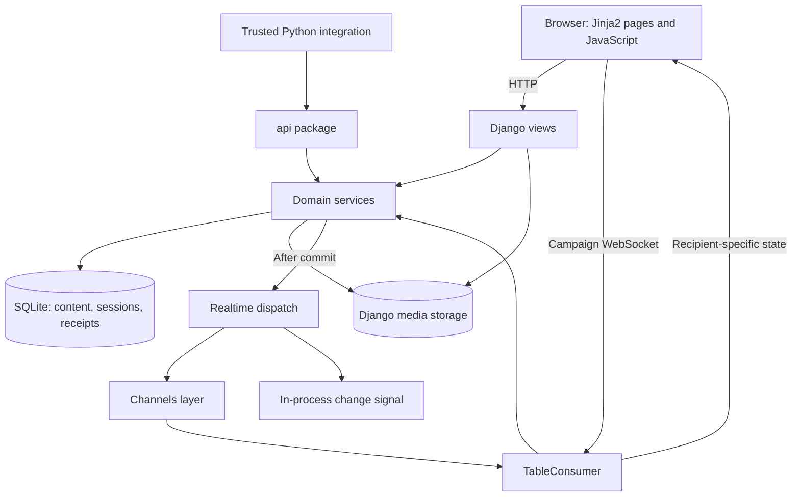

# Architecture

[Documentation](../README.md) · [Português](../pt-BR/architecture.md) · [Code map](code-map.md)

Gravewright is a Django virtual tabletop. The server owns campaign data, permissions,
command validation and persisted results. Jinja2 renders the application shell and
HTML fragments; browser JavaScript runs the interactive tabletop. Django Channels
connects each table socket to one campaign.

This document describes the implementation in this repository. For commands to run
it, see [Getting started](getting-started.md); for file-level navigation, see the
[code map](code-map.md). Extension authors should also read the
[API reference](api.md) and [module guide](modules.md).

## Runtime boundaries

- `config/asgi.py` starts Django and routes HTTP and WebSocket traffic.
  `config/proxy.py` restores forwarded schemes from trusted socket peers before
  routing. The socket stack checks the browser origin before resolving the session.
- `config/urls.py` composes app URL modules. HTTP paths beginning with `/api/` are
  view routes; the top-level `api/` directory is a **Python import interface**.
- `gravewright/<domain>/services.py` contains most business rules. Some upload,
  media and administration workflows live directly in view/helper modules, so a
  change should be traced through its actual URL or socket entry point.
- `gravewright/realtime/consumers.py` handles transport, subscriptions and transient
  connection state. It invokes synchronous services through
  `database_sync_to_async`; expensive dice evaluation uses `asyncio.to_thread`.
- `gravewright/realtime/dispatch.py` schedules committed resource invalidations,
  chat delivery and trusted Python extension signals.

The default database is SQLite with `transaction_mode='IMMEDIATE'`. Services express
serialization with atomic transactions and campaign/membership locks. SQLite does
not implement row-level `SELECT FOR UPDATE`; its write transaction controls
concurrency. Treat changes to transaction boundaries as behavioral changes.

Standard production settings require a Redis Channels layer. The in-memory layer is used
for one development process and by the dedicated [local runner](windows-runner.md);
it cannot carry notifications between workers. Redis
is the event transport, while campaign content, sessions and presence leases remain
in the database. See [Configuration](configuration.md).

The WebSocket origin check uses `GRAVEWRIGHT_PUBLIC_ORIGIN` when configured and
requires both the request Host and browser Origin to match its scheme, domain and
effective port. Without it, the check uses the ASGI `ws`/`wss` scheme, defaulting to
HTTP when absent. Pinning the public origin supports direct TLS with Daphne even
when its WebSocket adapter omits `scheme`. The
[proxy adapter](../../config/proxy.py) accepts one valid `X-Forwarded-Proto` value
only from a socket peer in `TRUSTED_PROXIES`, restoring the scheme for both HTTP and
WebSockets. See [Deployment](deployment.md) for TLS, proxy trust and static serving.

## Identity and authorization

There are two independent role systems:

| Scope | Roles | Meaning |
| --- | --- | --- |
| Host account (`accounts.User`) | `owner`, `participant` | Host administration and account bootstrap. A database constraint permits one owner. |
| Campaign (`campaigns.Membership`) | `gm`, `player`, `streamer` | Access to a particular table and its resources. |

The host owner creates campaigns and receives a GM membership for a new campaign.
Resource access checks campaign membership rather than assuming that a host role
grants access to every table. Actors/items additionally use per-user permission
maps; journals use `Access` rows and visibility rules.

`journals.services.member()` is shared across several domains. It reloads an active
user's membership and checks streamer expiration. `api.Context` holds normalized
campaign/user UUIDs only: constructing one does not grant authority or cache roles.
Public service entry points receive identifiers and resolve membership again.

WebSocket authorization also rereads the live database session, its configured auth
backend and the user's session authentication hash. It checks membership when
receiving commands, in delivery handlers and during heartbeats. Removing a member,
expiring a streamer link or invalidating a session therefore affects existing
connections as they are rechecked.

Streamer access is read-only. The socket consumer permits a limited set of sync,
search, viewport and heartbeat messages; write boundaries also reject streamers.
Client-side controls are a convenience, not the permission boundary.

**Scene visibility has two requirements for non-GMs:** the scene must have
`visibility='players'` and be the campaign's current `Broadcast`. Marking an inactive
scene visible does not make it readable. The same lookup protects manifests, tiles,
tokens and scene-context chat.

## Commands, retries and revisions

Most persistent tabletop resource commands follow this sequence:

1. Parse the requested operation and request UUID.
2. Start an atomic transaction, lock the campaign and reload membership.
3. Check write permission and look for a previously committed receipt.
4. Validate the operation's payload, resource scope and relevant revision.
5. Change models and record the result under the request UUID.
6. Register post-commit notifications and return the acknowledgement.

The exact order and replay behavior vary by domain; follow the owning service.
Uploads and administrative operations do not all use this receipt protocol.

| Identity store | Used by | Retry behavior |
| --- | --- | --- |
| `maps.Receipt` | Maps, actors, tokens, items, combat, cards, audio, compendiums | Shared `(campaign, user, request_id)` namespace. Most return the saved result; tokens rebuild visible state and filter saved created IDs. |
| `journals.Receipt` | Journal commands | Journal-specific result receipts; additional access checks apply to particular results. |
| `chat.Message` and `dice.Submission` | Chat and dice | Message identity prevents duplicate delivery records; dice claims prevent rerolling. |

Generate a **fresh UUID for each new logical command** and reuse it only to retry
that same command. In particular, do not reuse a UUID between an actor command and
an audio command: they share the same receipt table. Receipts do not generally
compare the retried action or payload with the original one.

Request identity and resource revision solve different problems. The request UUID
deduplicates a command; fields such as `version`, `sheetVersion` and
`expectedVersion` detect a stale editor. A conflict requires refreshed state and an
explicitly chosen new edit, not blindly changing a version number.

`transaction.on_commit()` prevents subscribers from being notified of rolled-back
changes. Dispatch uses robust callbacks and does not provide a durable event queue:
a committed mutation can survive a delivery failure. Clients should resynchronize
through state endpoints/subscriptions. Python `resource_changed` handlers are
trusted in-process callbacks; they are neither cross-process durable jobs nor an
untrusted-code sandbox.

## Domain behavior

### Campaigns and accounts

Account services rotate sessions on login, bound expensive password hashing and
store shared attempt windows under keyed hashes of client IP addresses. Campaign
services manage covers, hashed invitation/removal codes, redemption limits and
member removal. Streamer links create a dedicated guest identity with expiration
and revocation checks. The Inside interface composes these workflows in
`web/inside.py`.

### Actors, PDF sheets and tokens

An `Actor` is the reusable character source. `pdf_system/schema.py` normalizes its
sheet document, including PDF asset references, field values, bars, token settings
and active effects. Actor metadata and sheet data have separate revision counters.

A `Token` places an actor in a scene. Linked tokens use `Actor.data`; unlinked tokens
use their own `snapshot` and `sheet_version`. The first placement is linked. Placing
the same actor again converts existing linked placements into snapshots and creates
another snapshot; duplication also creates an independent snapshot. Sheet saves
must target the correct source and invalidate affected linked tokens.

Token movement checks control, locked state, revision, map bounds and, for non-GMs,
wall intersections. Drag previews are ephemeral coordinates validated by the same
movement rules. A preview does not save the final position; the persistent `move`
command does that. Outgoing previews are filtered again for each recipient and
discarded when their token version no longer matches.

### Maps and scene layers

Scene uploads validate the source image and configured byte/dimension/pixel/tile
limits, then generate a pyramid of lossless WebP tiles. `Scene` stores raster
metadata; `SceneState` stores scene-wide environment documents; `SceneObject`
stores typed objects such as walls, lights, images, markers and zones.

`maps/objects.py` coordinates object commands and layer projections. Specialized
helpers cover drawings/effects/images, marker ownership and zone geometry. State is
projected for the recipient: GM-layer images and private drawings are filtered;
undiscovered secret/invisible barriers lose interactive door presentation. Wall
geometry is still transmitted when needed for visibility clipping, so do not
describe the renderer as hiding all GM geometry from the client.

`realtime/scene_stream.py` validates viewport dimensions and generations, schedules
tile hints with bounded budgets and rejects stale scene versions. GM viewport
samples travel through Channels to per-player prefetch brokers. WebSocket messages
schedule loading; the actual raster bytes remain authenticated HTTP resources.

### Journals and handouts

Journals combine type-specific JSON with explicit grants. `documents.py` validates
structured content and filters GM blocks; `data.py` normalizes document shapes;
`types.py` handles behavior such as boards and quests. Player edits preserve hidden
GM content and cannot link arbitrary assets. `presentations.py` issues and resolves
recipient-bound handout tickets rather than making the underlying files public.

### Chat and dice

Chat history combines table-level messages and the selected/current broadcast scene,
then filters visibility and recipients. Supported message commands include whispers,
GM messages and emotes. Moderation removes content while retaining message identity
so a retry cannot recreate removed messages. Card chat attachments capture immutable
public faces instead of referencing a later-mutated deck.

Dice use `dice/engine.py` and the native Python grammar: parse, compile/validate,
then execute a bounded plan. Compilation consumes no randomness. The persistence
flow reserves a `Submission`, evaluates outside the database transaction, rechecks
authorization, and commits a `Message` with its result and fixed recipient audience.
A successful retry retrieves the stored result; an expired/interrupted claim
requires a new request rather than silently rerolling. The pure `api.dice.evaluate`
entry point does not persist or publish anything. See the existing
[grammar architecture](../../gravewright/dice/grammar/ARCHITECTURE.md) and
[notation specification](../../gravewright/dice/grammar/notation/GRAMMAR.md).

### Items, combat, cards, audio and compendiums

These five domains use `table/domain.py` for membership, transactions and receipts.
Their internal `state(who, ...)` and `command(who, ...)` helpers expect that boundary;
external callers use the public wrappers or `api.resources`.

| Domain | Responsibility and important boundary |
| --- | --- |
| Items | Versioned item documents with per-user grants. The native PDF implementation currently returns no item types, so ordinary item creation is unavailable until that capability is implemented. |
| Combat | A scene's encounter, initiative, current turn and bounded turn history. Turn order changes preserve combatant identity; progression can advance effects on actor documents. |
| Cards | Reusable definitions and mutable deck instances; draw/hand/scene/discard zones, ownership and face visibility. A GM's control permission does not automatically expose another player's hidden face. |
| Audio | Track uploads, playlists, playback transport and soundtrack scheduling. State projects positions using server time and spatial gain using controlled listener tokens and acoustic walls. HTTP file delivery remains separately authorized. |
| Compendiums | Campaign packs and native content catalog access. Portable bundles capture an allowlisted dependency graph and import documents/assets into a compatible campaign system. |

The older declarative formula helper in `combat/formula_engine.py` is distinct from
the chat dice grammar. Current combat initiative calls `dice.engine.evaluate`;
changing one engine does not automatically change the other.

## Archives and host administration

`administration/archives.py` explicitly allowlists native content models. Exports
include a content document, checksummed manifest and optional files. Portable exports
remove user-specific permissions and omit chat; snapshots additionally include
access/chat records for restoration. New-campaign imports and merges remap resource
identifiers and file paths. Restoration into the same campaign preserves resource
identifiers and replaces native content while retaining members, codes and snapshot
history. These archives are not complete host backups: accounts, sessions, host
settings and installed packages are separate operational state.

Import validates paths, archive size, expanded size, model/field allowlists and
checksums before creating content. Adding a model or file relationship requires
reviewing the archive selection, dependency graph and import rules, not only the
model definition.

`administration/updates.py` discovers configured source release metadata and caches
status. It does not replace the running installation. Host preferences and audit
records are separate models; feature toggles come from configuration. See
[Deployment](deployment.md) and [Development](development.md) before extending
these workflows.
