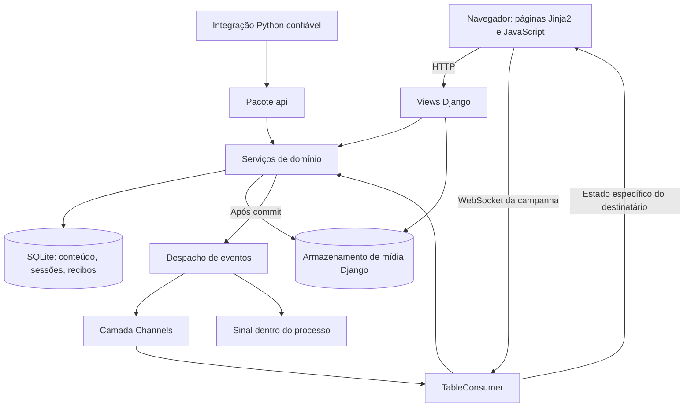

# Arquitetura

[Documentação](../README.pt-BR.md) · [English](../en/architecture.md) · [Mapa do código](code-map.md)

Gravewright é uma mesa virtual de RPG construída com Django. O servidor controla os
dados das campanhas, permissões, validação de comandos e resultados persistidos.
Jinja2 renderiza a estrutura da aplicação e fragmentos HTML; JavaScript no navegador
implementa a mesa interativa. Django Channels vincula cada conexão da mesa a uma
campanha.

Este documento descreve a implementação deste repositório. Para executá-la, consulte
[Primeiros passos](getting-started.md); para localizar arquivos, use o
[mapa do código](code-map.md). Autores de extensões também devem consultar a
[referência da API](api.md) e o [guia de módulos](modules.md).

## Divisões da aplicação em execução

- `config/asgi.py` inicializa Django e encaminha HTTP e WebSocket.
  `config/proxy.py` restaura esquemas encaminhados por pares confiáveis antes do
  roteamento. A pilha do socket verifica a origem antes de resolver a sessão Django.
- `config/urls.py` reúne as rotas dos apps. Caminhos HTTP iniciados por `/api/` são
  rotas de views; o diretório `api/` da raiz é uma **interface de importação Python**.
- `gravewright/<domínio>/services.py` contém a maior parte das regras de negócio.
  Alguns fluxos de upload, mídia e administração ficam nas próprias views ou em
  auxiliares; uma alteração deve ser acompanhada desde sua rota ou mensagem real.
- `gravewright/realtime/consumers.py` cuida do transporte, inscrições e estado
  temporário da conexão. Chama serviços síncronos com `database_sync_to_async`; a
  avaliação de dados usa `asyncio.to_thread` para o trabalho mais custoso.
- `gravewright/realtime/dispatch.py` agenda invalidações de recursos, entrega de
  chat e sinais para extensões Python após o commit.

O banco padrão é SQLite com `transaction_mode='IMMEDIATE'`. Os serviços expressam a
serialização com transações atômicas e bloqueios de campanha ou vínculo. SQLite não
implementa `SELECT FOR UPDATE` por linha; a transação de escrita controla a
concorrência. Alterar os limites dessas transações muda o comportamento.

A configuração padrão de produção exige uma camada Channels com Redis. A camada em memória
serve para um único processo de desenvolvimento e para o [executor local](windows-runner.md);
não entrega eventos entre processos. Redis transporta eventos; conteúdo, sessões e registros de presença ficam
no banco. Consulte [Configuração](configuration.md).

A verificação de origem WebSocket usa `GRAVEWRIGHT_PUBLIC_ORIGIN` quando configurada
e exige que Host da requisição e Origin do navegador correspondam ao esquema,
domínio e porta efetiva. Sem ela, usa o esquema ASGI `ws`/`wss`, assumindo HTTP quando
ausente. Fixar a origem pública permite TLS direto no Daphne mesmo quando seu
adaptador WebSocket omite `scheme`. O [adaptador de proxy](../../config/proxy.py)
aceita um único valor válido de `X-Forwarded-Proto` apenas de um par conectado em
`TRUSTED_PROXIES`, restaurando o esquema para HTTP e WebSockets. Veja
[Implantação](deployment.md) para TLS, confiança em proxies e arquivos estáticos.

## Identidade e autorização

Existem dois sistemas de papéis independentes:

| Escopo | Papéis | Significado |
| --- | --- | --- |
| Conta do servidor (`accounts.User`) | `owner`, `participant` | Administração do servidor e configuração inicial. Uma restrição do banco permite um proprietário. |
| Campanha (`campaigns.Membership`) | `gm`, `player`, `streamer` | Acesso a uma mesa específica e aos seus recursos. |

O proprietário do servidor cria campanhas e recebe um vínculo de mestre (`gm`) ao
criar uma. Os recursos verificam o vínculo na campanha, sem pressupor que um papel
do servidor concede acesso a todas as mesas. Atores e itens também usam mapas de
permissões por usuário; diários usam registros `Access` e regras de visibilidade.

`journals.services.member()` é compartilhado por vários domínios. Recarrega o vínculo
de um usuário ativo e verifica a validade de acesso de streamers. `api.Context`
contém somente UUIDs normalizados de campanha e usuário: construí-lo não concede
permissões nem armazena papéis em cache. Os serviços públicos recebem identificadores
e resolvem novamente o vínculo.

A autorização WebSocket também relê a sessão no banco, o backend de autenticação
configurado e o hash de autenticação de sessão do usuário. Verifica vínculos ao
receber comandos, nos manipuladores de entrega e durante heartbeats. Remover um
participante, expirar um link de streamer ou invalidar uma sessão afeta conexões
existentes conforme essas verificações voltam a ocorrer.

Streamers têm acesso somente de leitura. O consumidor permite um conjunto limitado
de mensagens de sincronização, busca, viewport e heartbeat; os pontos de escrita
também os rejeitam. Controles no navegador são conveniências, não a autorização.

**A visibilidade de cenas exige duas condições para quem não é mestre:** a cena deve
ter `visibility='players'` e ser o `Broadcast` atual da campanha. Marcar uma cena
inativa como visível não a torna acessível. A mesma resolução protege manifestos,
blocos de imagem, tokens e chat associado à cena.

## Comandos, tentativas repetidas e revisões

A maioria dos comandos persistentes de recursos da mesa segue esta sequência:

1. Interpretar a operação solicitada e o UUID da requisição.
2. Iniciar uma transação atômica, bloquear a campanha e recarregar o vínculo.
3. Verificar permissão de escrita e procurar um recibo já confirmado.
4. Validar o conteúdo, o escopo do recurso e a revisão aplicável.
5. Alterar os modelos e registrar o resultado com o UUID da requisição.
6. Agendar notificações após o commit e retornar a confirmação.

A ordem exata e a repetição variam por domínio; siga o serviço responsável. Uploads
e operações administrativas nem sempre utilizam esse protocolo de recibos.

| Registro de identidade | Usado por | Comportamento da repetição |
| --- | --- | --- |
| `maps.Receipt` | Mapas, atores, tokens, itens, combate, cartas, áudio e compêndios | Compartilham `(campaign, user, request_id)`. A maioria retorna o resultado salvo; tokens recompõem o estado visível e filtram os IDs criados anteriormente. |
| `journals.Receipt` | Comandos de diários | Recibos próprios de diários; alguns resultados exigem verificações adicionais de acesso. |
| `chat.Message` e `dice.Submission` | Chat e dados | A identidade da mensagem evita registros duplicados; a reserva de dados impede rolar novamente. |

Gere um **UUID novo para cada comando lógico novo** e reutilize-o somente para
repetir o mesmo comando. Não reutilize, por exemplo, o UUID de um comando de ator em
um comando de áudio: ambos compartilham a tabela de recibos. Em geral, os recibos não
comparam a ação ou o conteúdo repetido com o original.

Identidade da requisição e revisão do recurso resolvem problemas distintos. O UUID
evita duplicação; campos como `version`, `sheetVersion` e `expectedVersion` detectam
edições com estado desatualizado. Um conflito exige atualizar os dados e escolher
explicitamente uma nova edição, não apenas trocar o número da versão.

`transaction.on_commit()` evita notificações sobre alterações revertidas. O despacho
usa callbacks robustos, mas não oferece uma fila durável: uma alteração confirmada
pode permanecer mesmo se sua notificação falhar. Clientes devem sincronizar novamente
pelos endpoints ou inscrições de estado. Manipuladores Python de `resource_changed`
são callbacks confiáveis dentro do processo; não são tarefas duráveis entre processos
nem uma sandbox para código não confiável.

## Comportamento dos domínios

### Campanhas e contas

Os serviços de contas renovam a identidade da sessão no login, limitam o trabalho de
hash de senha em paralelo e armazenam janelas de tentativas sob hashes autenticados
dos endereços IP. Os serviços de campanhas controlam capas, códigos de convite e
remoção armazenados como hash, limites de resgate e remoção de participantes. Links
de streamer criam uma identidade visitante específica com validade e revogação.
A interface Inside reúne esses fluxos em `web/inside.py`.

### Atores, fichas PDF e tokens

Um `Actor` é a fonte reutilizável do personagem. `pdf_system/schema.py` normaliza a
ficha, incluindo referências a PDFs, campos, barras, configurações de token e efeitos
ativos. Metadados do ator e dados da ficha têm contadores de revisão distintos.

Um `Token` posiciona o ator em uma cena. Tokens vinculados usam `Actor.data`; tokens
desvinculados usam `snapshot` e `sheet_version` próprios. A primeira colocação é
vinculada. Colocar o mesmo ator novamente converte as colocações vinculadas em
snapshots e cria outro snapshot; duplicar também gera um snapshot independente. O
salvamento da ficha precisa atingir a fonte correta e invalidar os tokens vinculados
afetados.

Movimentar um token verifica controle, bloqueio, revisão, limites do mapa e, para
quem não é mestre, interseções com paredes. Pré-visualizações de arraste são
coordenadas temporárias validadas pelas mesmas regras. Elas não salvam a posição
final; o comando persistente `move` faz isso. Cada destinatário recebe novamente uma
versão filtrada dessas prévias, que são descartadas se a versão do token mudou.

### Mapas e camadas das cenas

Uploads de cenas validam a imagem e os limites configurados de bytes, dimensões,
pixels e quantidade de blocos; depois geram uma pirâmide de blocos WebP sem perdas.
`Scene` armazena metadados da imagem, `SceneState` guarda documentos do ambiente da
cena e `SceneObject` registra objetos tipados, como paredes, luzes, imagens,
marcadores e zonas.

`maps/objects.py` coordena comandos de objetos e projeções de camadas. Auxiliares
especializados tratam desenhos, efeitos, imagens, propriedade de marcadores e
geometria de zonas. O estado é preparado para cada destinatário: imagens na camada
do mestre e desenhos privados são filtrados; barreiras secretas ou invisíveis ainda
não descobertas perdem a apresentação de porta interativa. A geometria das paredes
ainda é transmitida quando necessária ao recorte de visibilidade; portanto, o
renderizador não esconde toda a geometria do mestre do cliente.

`realtime/scene_stream.py` valida dimensões e gerações do viewport, agenda sugestões
de blocos com orçamentos limitados e rejeita versões de cena antigas. Amostras do
viewport do mestre passam por Channels para preditores de pré-carregamento por
jogador. WebSocket agenda o carregamento; os bytes das imagens continuam em recursos
HTTP autenticados.

### Diários e materiais apresentados

Diários combinam JSON específico do tipo com concessões explícitas de acesso.
`documents.py` valida conteúdo estruturado e filtra blocos do mestre; `data.py`
normaliza os formatos; `types.py` trata comportamentos como quadros e missões.
Edições de jogadores preservam conteúdo oculto do mestre e não podem associar
arquivos arbitrários. `presentations.py` emite e resolve tickets vinculados ao
destinatário, sem tornar públicos os arquivos originais.

### Chat e dados

O histórico combina mensagens da mesa e da cena selecionada ou transmitida,
filtrando visibilidade e destinatários. Há comandos para sussurros, mensagens ao
mestre e ações narrativas. A moderação remove o conteúdo e mantém a identidade da
mensagem, evitando que uma repetição a recrie. Anexos de cartas no chat capturam
faces públicas imutáveis, em vez de apontar para um baralho que pode mudar depois.

Os dados usam `dice/engine.py` e a gramática Python nativa: análise, compilação e
validação, seguidas da execução de um plano limitado. A compilação não consome
aleatoriedade. O fluxo persistente reserva um `Submission`, avalia fora da transação
do banco, verifica novamente a autorização e confirma um `Message` com o resultado
e destinatários definidos. Uma repetição bem-sucedida recupera o resultado salvo;
uma reserva expirada ou interrompida exige outra requisição, sem rolar novamente de
forma silenciosa. A função pura `api.dice.evaluate` não persiste nem publica dados.
Consulte a [arquitetura da gramática](../../gravewright/dice/grammar/ARCHITECTURE.pt-BR.md)
e a [especificação da notação](../../gravewright/dice/grammar/notation/GRAMMAR.pt-BR.md)
disponíveis em português.

### Itens, combate, cartas, áudio e compêndios

Esses cinco domínios usam `table/domain.py` para vínculos, transações e recibos. Seus
auxiliares internos `state(who, ...)` e `command(who, ...)` pressupõem esse ponto de
entrada; integrações usam os wrappers públicos ou `api.resources`.

| Domínio | Responsabilidade e restrição relevante |
| --- | --- |
| Itens | Documentos versionados com permissões por usuário. A implementação PDF nativa atualmente não retorna tipos de item; a criação comum fica indisponível até que essa capacidade seja implementada. |
| Combate | Encontro da cena, iniciativa, turno atual e histórico limitado. Mudanças de ordem preservam a identidade do combatente; a progressão pode avançar efeitos nos documentos dos atores. |
| Cartas | Definições reutilizáveis e instâncias mutáveis; zonas de compra, mão, cena e descarte, propriedade e visibilidade. O controle do mestre não revela automaticamente a face oculta de outro jogador. |
| Áudio | Uploads, playlists, reprodução e trilhas sonoras. O estado calcula posições pelo horário do servidor e ganho espacial pelos tokens controlados e paredes acústicas. A entrega HTTP do arquivo tem autorização própria. |
| Compêndios | Pacotes da campanha e acesso ao catálogo nativo. Arquivos portáteis capturam um grafo permitido de dependências e importam documentos e arquivos para uma campanha de sistema compatível. |

O auxiliar declarativo de fórmulas em `combat/formula_engine.py` é distinto da
gramática de dados do chat. A iniciativa atual chama `dice.engine.evaluate`; alterar
um interpretador não altera automaticamente o outro.

## Arquivos portáteis e administração

`administration/archives.py` define explicitamente os modelos de conteúdo permitidos.
Exportações incluem documento de conteúdo, manifesto com hashes e arquivos opcionais.
Exportações portáteis removem permissões específicas de usuários e omitem chat;
snapshots também incluem registros de acesso e chat para restauração. Importações
em campanha nova e mesclagens remapeiam identificadores e caminhos de arquivos.
Restaurações na mesma campanha preservam identificadores e substituem o conteúdo
nativo, mantendo participantes, códigos e histórico de snapshots. Esses arquivos
não são backups completos do servidor: contas, sessões, configurações e pacotes
instalados são dados operacionais separados.

A importação valida caminhos, tamanho do ZIP, tamanho descompactado, modelos, campos
e hashes antes de criar conteúdo. Adicionar um modelo ou relacionamento de arquivo
exige revisar a seleção, o grafo de dependências e as regras de importação, além da
definição do modelo.

`administration/updates.py` consulta metadados de versões de código-fonte do
repositório configurado e armazena o estado em cache. Ele não substitui a instalação
em execução. Preferências do servidor e auditoria usam modelos separados; recursos
habilitados dependem da configuração. Leia [Implantação](deployment.md) e
[Desenvolvimento](development.md) antes de ampliar esses fluxos.
