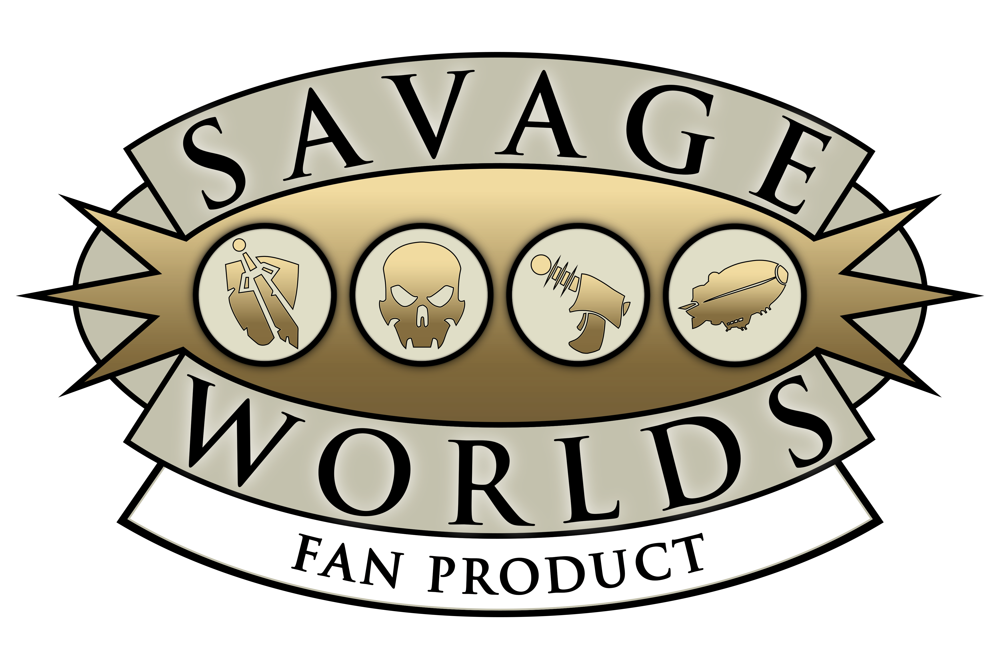

Fonte oficial do logotipo: [SW_LOGO_FP_2018.png](https://peginc.com/wp-content/uploads/2019/01/SW_LOGO_FP_2018.png)

# Pacote de compatibilidade Savage Worlds para Gravewright

Ruleset SDK 1 com fichas editáveis, rolagens com dados explosivos, automações de combate, chat localizado, avisos de Benes e iniciativa por cartas.

Versão do pacote: **1.1.0**

> “This game references the Savage Worlds game system, available from Pinnacle Entertainment Group at www.peginc.com. Savage Worlds and all associated logos and trademarks are copyrights of Pinnacle Entertainment Group. Used with permission. Pinnacle makes no representation or warranty as to the quality, viability, or suitability for purpose of this product.”

Tradução informativa: este jogo faz referência ao sistema Savage Worlds, disponível pela Pinnacle Entertainment Group em www.peginc.com. Savage Worlds e todos os logotipos e marcas associados pertencem à Pinnacle Entertainment Group. Usado com permissão. A Pinnacle não oferece garantia sobre a qualidade, viabilidade ou adequação deste produto.

Este pacote gratuito fornece somente compatibilidade técnica. Ele não é vendido nem colocado atrás de acesso pago e não distribui textos do livro de regras, PDFs, compêndios, material de cenários ou outros conteúdos de jogo da Pinnacle. Os dados e referências de regras são fornecidos pelos usuários da mesa.

English: [README.md](README.md)

## Recursos

- Fichas de Carta Selvagem, Extra, Veículo e Grupo.
- Itens de Perícia, Arma, Armadura, Escudo, Equipamento, Vantagem, Complicação e Poder. Todo item solto na ficha vira uma cópia independente e editável.
- Dados explosivos, Dado Selvagem, teste sem perícia, modificadores situacionais, multiação, alcance e dano adicional por aumento.
- Cálculo automático de Aparar, Resistência, limite de carga, sobrecarga e penalidades de Ferimentos e Fadiga.
- Condições sincronizadas com efeitos e aplicadas aos derivados e às rolagens compatíveis.
- Cartões de rolagem traduzidos no idioma de quem lê; fórmula e dados individuais ficam em uma seção recolhível.
- Aviso localizado ao ganhar ou gastar Benes.
- Iniciativa por Carta de Ação usando um baralho ativo: embaralha inicialmente, revela uma carta por combatente no chat, ordena por valor e naipe e só reembaralha após uma rodada em que um Curinga foi sacado.

## Iniciativa por cartas

Crie ou instancie um baralho comum no painel **Cartas** do Gravewright. Durante um combate ativo, o mestre pode usar **Distribuir Cartas de Ação** na barra do rastreador. O pacote escolhe primeiro um baralho com cartas suficientes; se necessário, reinicia e embaralha o primeiro baralho disponível.

Os nomes podem estar em português ou inglês. Coringas aparecem primeiro como ordem padrão do rastreador, mas podem agir a qualquer momento; as demais cartas seguem do Ás ao Dois e os empates usam Espadas, Copas, Ouros e Paus. O baralho é embaralhado inicialmente e depois somente após uma rodada em que um Curinga foi sacado. Autores de baralho podem evitar interpretação do nome informando `initiative` e, opcionalmente, `suitRank` nos metadados da carta.

## Estrutura do pacote

```text
assets/       CSS e imagens do ruleset
scripts/      controladores e automações do ruleset
sheets/       fichas HTML de atores
layouts/      fichas declarativas e layouts de itens
schemas/      esquemas de atores e itens
rules/        fórmulas, derivados, ações, condições, validação e combate
mappings/     apresentação de chat, toast e tokens
locales/      catálogos em inglês e português do Brasil
```

Todo CSS e JavaScript específico de Savage Worlds fica dentro deste pacote. Alterações no core do Gravewright se limitam a contratos genéricos de SDK e renderização.

## Instalação e validação

Na raiz do Gravewright:

```bash
grave package validate data/packages/rulesets/savage-worlds
grave package install data/packages/rulesets/savage-worlds --yes --enable
```

Ative `savage-worlds` como ruleset exclusivo da campanha. Após atualizar arquivos do pacote, reinstale-o ou reinicie o servidor de desenvolvimento caso o cache de pacotes esteja ativo.

## Licença

O código original e os dados declarativos de compatibilidade usam a [Licença Apache 2.0](LICENSE). Essa licença não se aplica ao nome Savage Worlds, às marcas ou ao logotipo fornecido. Consulte [NOTICE](NOTICE) para o aviso de permissão e os limites de distribuição.
